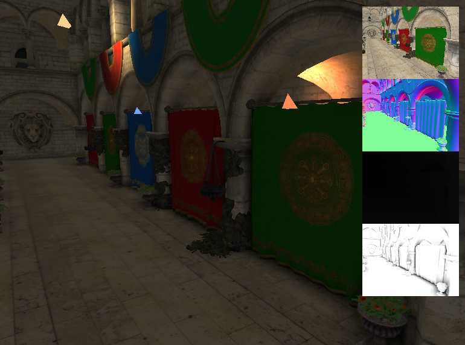

# OpenGL-Renderer

deffered rendering, shadow, SSAO를 사용해 Sponza를 렌더링하는 OpenGL 렌더러입니다.



## 렌더링

- G-buffer: albedo, normal, depth를 저장합니다.
- geometry pass, deferred lighting pass를 수행합니다.
- blur pass를 포함한 SSAO를 계산합니다.

## 라이브러리

- GLFW `3.4`
- Assimp `v6.0.4`
- GLM `1.0.3`
- GLAD `v0.1.36` generated through the upstream CMake helper
- `stb` for `stb_image.h`
- Dear ImGui `v1.92.7`

## 빌드

```powershell
cmake --preset windows-debug
cmake --build --preset windows-debug
```

## 조작

- `W/A/S/D`: 카메라 이동
- `Space / Left Shift`: 위/아래 이동
- 마우스 왼쪽 드래그: 카메라 회전
- `P`: debug buffer preview 토글
- `O`: point light marker 토글
- `Esc`: 애플리케이션 종료
