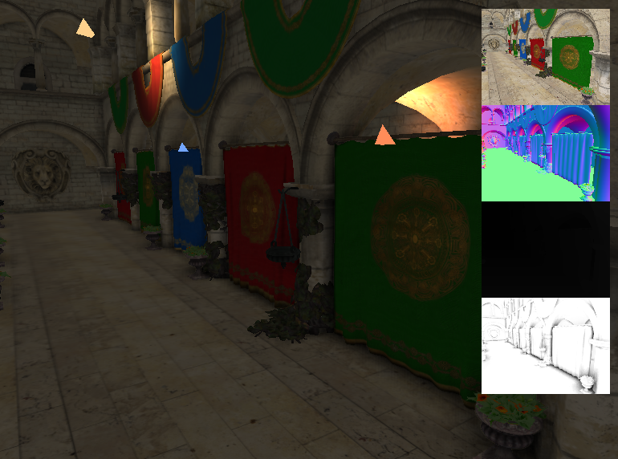

# OpenGL-Renderer

C++ / OpenGL 기반 deferred renderer입니다.  
Sponza scene을 대상으로 G-buffer, deferred lighting, shadow mapping, SSAO, debug buffer preview를 구현했습니다.



## 렌더링

- G-buffer: albedo, normal, depth를 저장합니다.
- geometry pass, deferred lighting pass를 수행합니다.
- directional light의 shadow mapping을 수행합니다.
- SSAO와 blur pass를 수행합니다.

## 라이브러리

- GLFW `3.4`
- Assimp `v6.0.4`
- GLM `1.0.3`
- GLAD `v0.1.36` generated through the upstream CMake helper
- `stb` for `stb_image.h`
- Dear ImGui `v1.92.7`

## Credits

- Sponza 2022 Scene by Frank Meinl and Anton Kaplanyan, Intel Sample Library, licensed under CC BY 4.0.

## 빌드

첫 CMake configure 시 `assets/main_sponza/NewSponza_Main_glTF_003.gltf`가 없으면 Intel GPU Research Samples의 Sponza Base Scene을 인터넷에서 자동으로 다운로드해 `assets/main_sponza`에 압축 해제합니다. 다운로드 크기는 약 3.71 GB입니다.

```powershell
cmake --preset windows-debug
cmake --build --preset windows-debug
```

이미 리소스를 직접 준비했거나 자동 다운로드를 막고 싶다면 configure 때 `-DOPENGL_RENDERER_DOWNLOAD_SPONZA=OFF`를 지정할 수 있습니다. 이 경우 `assets/main_sponza`가 없으면 configure가 실패합니다.

## 조작

- `W/A/S/D`: 카메라 이동
- `Space / Left Shift`: 위/아래 이동
- 마우스 왼쪽 드래그: 카메라 회전
- `P`: debug buffer preview 토글
- `O`: point light marker 토글
- `Esc`: 애플리케이션 종료
