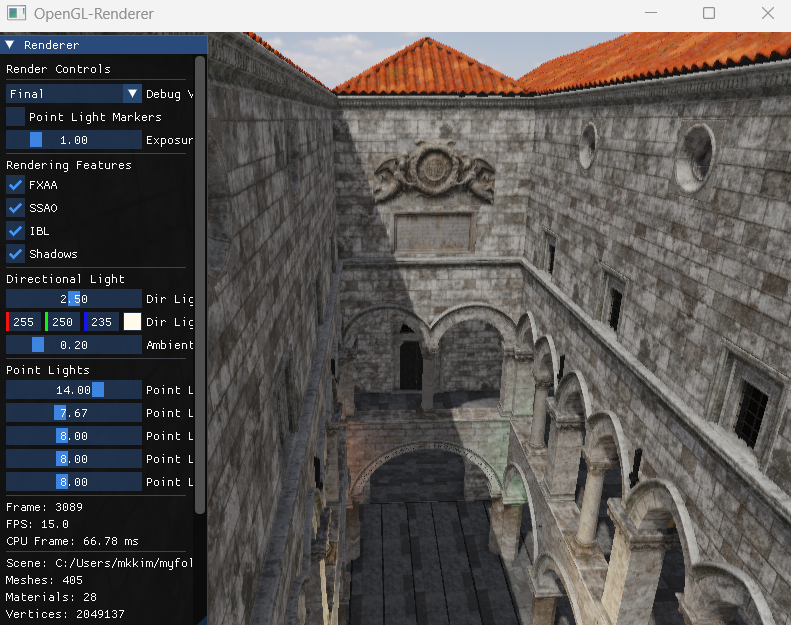
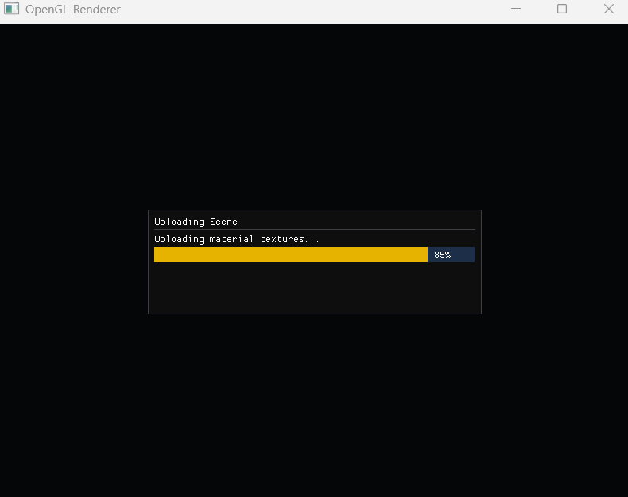
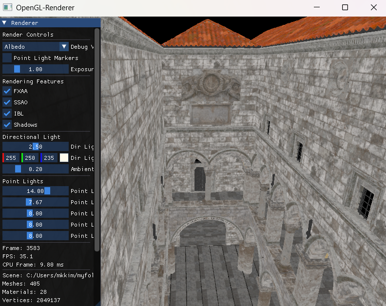
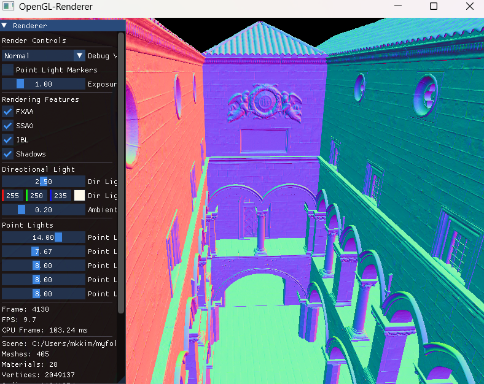
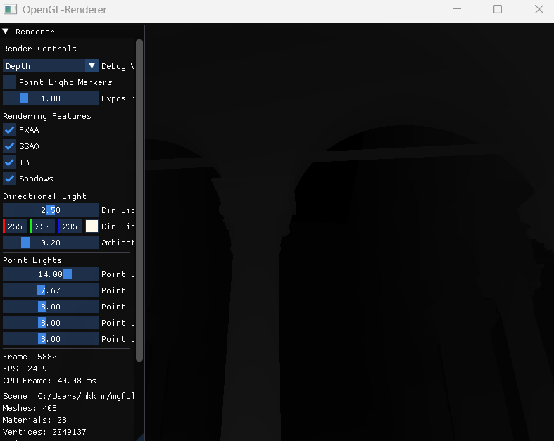
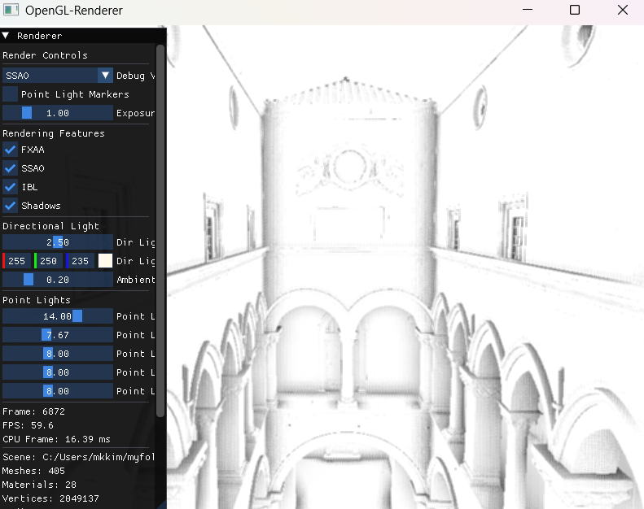
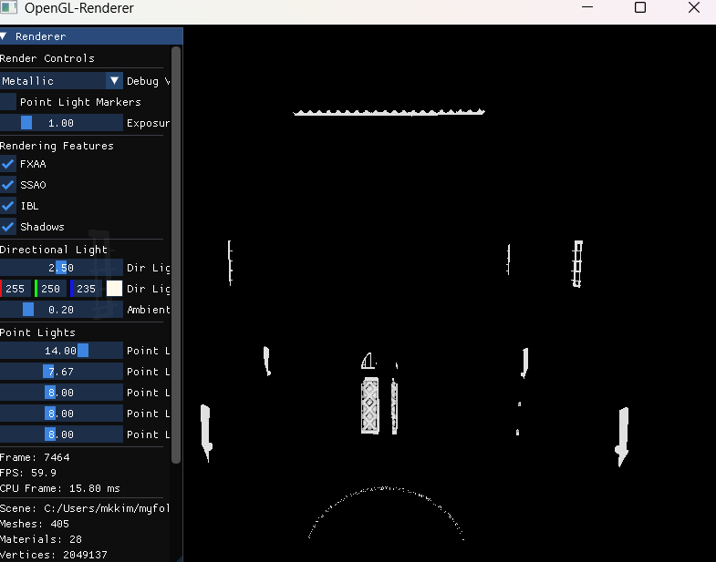
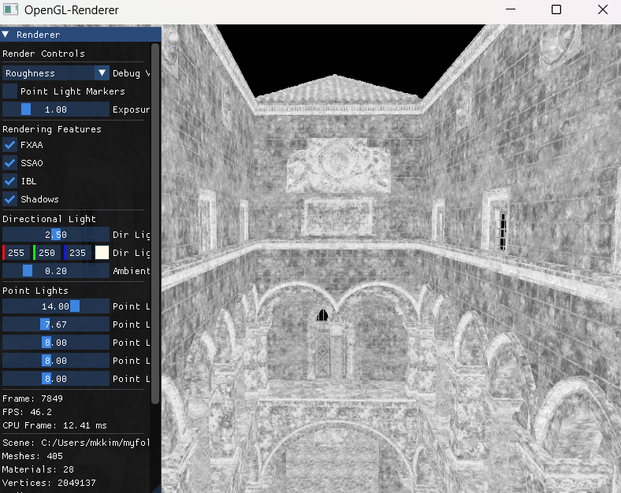
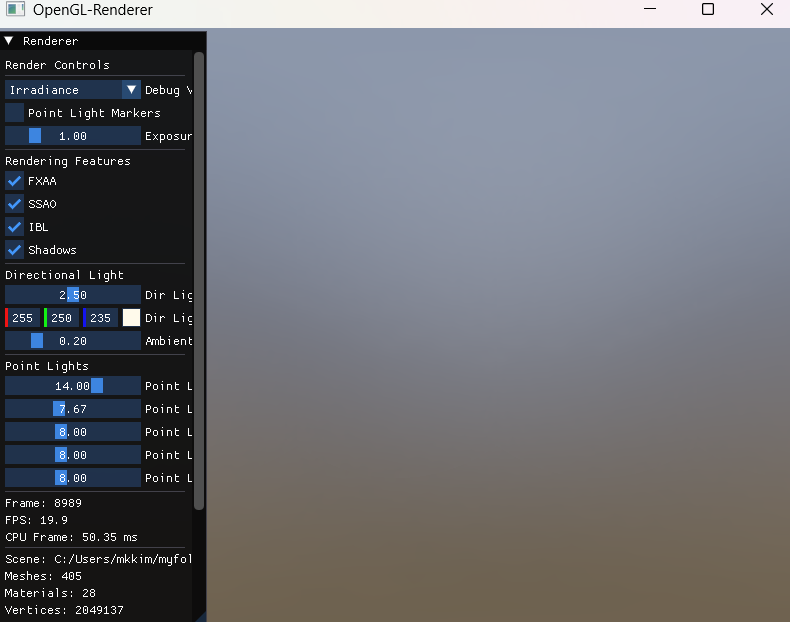
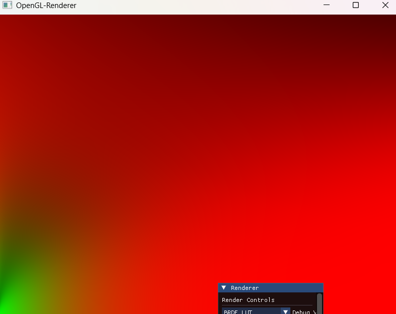

# OpenGL-Renderer

C++ / OpenGL 기반 PBR deferred renderer입니다.  
Intel Sponza scene을 대상으로 렌더링 기법들을 구현했습니다.



## 주요 기능

### 렌더링 파이프라인

- **Deferred Rendering**: G-buffer (albedo, normal, material, emissive, depth) 기반 렌더링
- **Image-Based Lighting (IBL)**: 환경맵 기반 조명
  - Diffuse irradiance mapping
  - Specular prefilter with BRDF LUT
  - Mipmap-based roughness handling
- **Shadow Mapping**: Directional light 그림자
- **Screen-Space Ambient Occlusion (SSAO)**: 환경 차폐 + blur
- **FXAA**: Fast approximate anti-aliasing
- **Tone Mapping**: HDR → SDR 변환
- **Point Lights**: 5개 동적 광원

### 씬 로딩 및 최적화

- glTF 형식 지원 (Assimp 기반)
- **비동기 텍스처 로딩**: 프레임 예산 (8ms/frame) 관리
- GPU 리소스 캐싱
- 로딩 화면 UI
- 진행률 표시

### 개발 편의 기능

- **18개 디버그 뷰 모드**: 각 렌더링 단계 시각화
- **셰이더 핫 리로드**: 실행 중 셰이더 수정
- ImGui 기반 렌더링 컨트롤
- Point light 마커 시각화
- 실시간 성능 통계

## 시스템 요구사항

- **Windows 10 이상**
- **Visual Studio 2019+** (또는 다른 C++17 컴파일러)
- **CMake 3.20+**
- **OpenGL 4.5** 이상 GPU
- **인터넷** (Sponza 씬 자동 다운로드용, 약 3.71 GB)

## 라이브러리

- GLFW `3.4`
- GLM `1.0.3`
- Assimp `v6.0.4`
- GLAD `v0.1.36`
- stb (stb_image.h)
- Dear ImGui `v1.92.7`

## 빌드 및 실행

### 빌드

```powershell
cmake --preset windows-debug
cmake --build --preset windows-debug
```

첫 CMake configure 시 Sponza 씬(3.71 GB)을 자동으로 다운로드합니다.  
자동 다운로드를 비활성화하려면:

```powershell
cmake --preset windows-debug -DOPENGL_RENDERER_DOWNLOAD_SPONZA=OFF
```

### 실행

```powershell
.\out\build\windows-debug\Debug\OpenGL-Renderer.exe
```

커스텀 씬 로드:

```powershell
.\out\build\windows-debug\Debug\OpenGL-Renderer.exe path/to/scene.gltf
```

## 조작

### 카메라 제어

- `W/A/S/D`: 전진/좌/후진/우
- `Space / Shift`: 상승/하강
- **마우스 왼쪽 드래그**: 카메라 회전 (클릭으로 활성화)

### UI 제어

- `P`: 디버그 뷰 모드 순환 (18개 모드: 최종 결과, G-buffer, IBL 맵 등)
- `O`: Point light 마커 표시/숨김
- `R`: 셰이더 핫 리로드
- `Esc`: 마우스 해제 / 애플리케이션 종료

### ImGui 컨트롤

- **Debug View**: 렌더링 단계별 디버그 뷰 선택
- **Rendering Features**: FXAA, SSAO, IBL, Shadows 토글
- **Directional Light**: 강도, 색상, 주변광 조절
- **Point Lights**: 5개 광원의 강도 조절
- **Exposure**: HDR tone mapping 노출도

## 렌더링 결과

### 최종 결과 및 로딩



### G-Buffer 시각화




### 렌더링 기법 시각화




### IBL 맵



## Credits

- Sponza 2022 Scene by Frank Meinl and Anton Kaplanyan, Intel Sample Library, licensed under CC BY 4.0.
